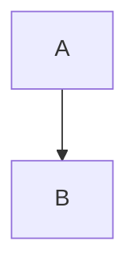

```
💡 此文章主要是紀錄建站過程，不是教學。
```
# 目標
- 在obsidian寫作；博客網站展示
- 一鍵發布文章（自動化流程）

# 前置要求
- 筆者使用macOS
- 已安裝好docker
- 遠端Linux主機的SSH
- 遠端Linux主機公開的port端口

# 建置網站
```
💡 影片中將網站部屬至Hostinger；本文將使用自己主機部屬。
```

主要參考此影片來建置：
[I started a blog.....in 2024 (why you should too) - YouTube](https://www.youtube.com/watch?v=dnE7c0ELEH8)。
影片中的內容這裡就不重複撰寫了，直接看他的筆記 [My Insane Blog Pipeline :: Terminal](https://blog.networkchuck.com/posts/my-insane-blog-pipeline/)。

## 主要步驟
1. Obsidian準備好一個資料夾（放置要公開的文章）
2. 安裝hugo
3. 產生hugo專案檔案
4. 安裝hugo主題
5. 編寫圖片遷移腳本
6. 編寫自動化流程腳本
7. 部屬至主機

# 我的設定
### 主題
筆者使用[PaperMod](https://adityatelange.github.io/hugo-PaperMod/)，官網教學推薦使用git submodule安裝
```
git submodule add --depth=1 https://github.com/adityatelange/hugo-PaperMod.git themes/PaperMod
```

<details>
<summary>什麼是git submodule? 🤖GPT explain</summary>
Git submodule 是 Git 版本控制系統中的一個功能，它允許你將一個 Git 儲存庫作為另一個 Git 儲存庫的子目錄。這樣做的主要好處是可以在你的專案中包含和使用其他專案的程式碼，同時保持兩個專案的獨立性。

這個命令的作用是：
1. 將 hugo-PaperMod 這個 Hugo 主題的 Git 儲存庫添加為你當前專案的一個子模組
2. 子模組會被克隆到 themes/PaperMod 目錄下
3. `--depth=1` 參數表示只克隆最新的一個版本的代碼，不包含完整的歷史記錄，這樣可以節省空間和下載時間

使用 submodule 的優點：
- 可以在你的專案中使用其他專案的程式碼，而不需要複製貼上或手動更新
- 當原始專案（在這個例子中是 hugo-PaperMod 主題）更新時，你可以輕鬆地更新你的子模組
- 你可以保持對使用的特定版本的控制

</details>

---

作者推薦使用yaml來設定，筆者還是習慣使用toml
使用 [YAML to TOML](https://transform.tools/yaml-to-toml) 來轉換格式

如果是複製 [PaperMod 的範例設定檔](https://adityatelange.github.io/hugo-PaperMod/posts/papermod/papermod-installation/#sample-configyml)，  
記得`hugo.toml` 要移除`paginate = 5`這行設定，因新版hugo已經棄用，不然會報錯。

## 自動化腳本
筆者在影片提供的腳本基礎上修改。

圖片遷移腳本：
- 修改了regex，支援png、jpg
- 顯示Markdown檔案修改統計與圖片數量
```python
import os
from pathlib import Path
import re
import shutil


# Paths
BASE_PATH = Path("/Users/rrrfff/")
POSTS_DIR = BASE_PATH / "ouob-hugo/content/posts/"
ATTACHMENTS_DIR = BASE_PATH / "Resilio/Obsidian/z_attach_img/"
STATIC_IMAGES_DIR = BASE_PATH / "ouob-blogs/static/images/"


count = 0

# Step 1: Process each markdown file in the posts directory
for file_path in POSTS_DIR.glob("*.md"):
    with open(file_path, "r") as file:
        content = file.read()

        # Step 2: Find all image links in the format 
        images = re.findall(r"\[\[([^\]]+\.(?:png|jpg|jpeg))\]\]", content)

        # Step 3: Replace image links and ensure URLs are correctly formatted
        for image in images:
            # Prepare the Markdown-compatible link with %20 replacing spaces
            markdown_image = f"[Image Description](/images/{image.replace(' ', '%20')})"
            content = content.replace(f"[[{image}]]", markdown_image)

            # Step 4: Copy the image to the Hugo static/images directory if it exists
            image_source = ATTACHMENTS_DIR / image
            if image_source.exists():
                shutil.copy(image_source, STATIC_IMAGES_DIR)
            count += 1

        # Step 5: Write the updated content back to the markdown file
        with open(file_path, "w") as file:
            file.write(content)

if count == 0:
    print("No images found in the markdown files.")
else:
    print(f"Processed {len(list(POSTS_DIR.glob('*.md')))} markdown files.")
    print(f"Copied {count} images to the Hugo static/images directory.")
```

一鍵發布腳本：
- 根據筆者自己的流程修改

步驟：
1. 設定變量
2. 驗證所需工具
3. 驗證SSH連線
4. 驗證路徑已存在
5. rsync: Obsidian文章 至 公開庫 與 hugo專案
6. 圖片遷移
7. hugo建構靜態檔案
8. 公開庫: git add
9. 公開庫: git commit
10. 公開庫: git push
11. rsync: hugo靜態檔案 至 遠端伺服器
```bash
#!/bin/bash
set -euo pipefail

# Change to the script's directory
SCRIPT_DIR="$(cd "$(dirname "${BASH_SOURCE[0]}")" && pwd)"
cd "$SCRIPT_DIR"

# Set variables for Obsidian to Hugo copy
basePath="/Users/rrrfff"
sourcePath="${basePath}/Resilio/Obsidian/ouob_posts"
publicPostRepoPath="${basePath}/ouob-blogs/posts"
destinationPath="${basePath}/ouob-hugo/content/posts"
hugoPublicPath="${basePath}/ouob-hugo/public"

# Set GitHub Repo
publicRepo="git@github.com:swy641205/ouob-blogs.git"
publicRepoPath="${basePath}/ouob-blogs"
deployRepo="git@github.com:swy641205/ouob-hugo.git"

sshName="s5nuuvm_o"

# Check for required commands
for cmd in git rsync python3 hugo; do
    if ! command -v $cmd &> /dev/null; then
        echo "$cmd is not installed or not in PATH."
        exit 1
    fi
done

# check ssh connection
if ! ssh -o BatchMode=yes -o ConnectTimeout=5 ${sshName} exit; then
    echo "SSH connection failed."
    exit 1
fi


# Step 2: Sync posts from Obsidian to Hugo content folder
# and puvblicRepo path using rsync
echo "Syncing posts from Obsidian..."

if [ ! -d "$sourcePath" ]; then
    echo "Source path does not exist: $sourcePath"
    exit 1
fi

if [ ! -d "$publicPostRepoPath" ]; then
    echo "Public Repo path does not exist: $publicPostRepoPath"
    exit 1
fi

if [ ! -d "$destinationPath" ]; then
    echo "Destination path does not exist: $destinationPath"
    exit 1
fi

# 源路徑 / 代表複製資料夾裡面的檔案 不是直接複製資料夾本身
rsync -avuz --delete "$sourcePath/" "$destinationPath"
rsync -avuz --delete "$sourcePath/" "$publicPostRepoPath"

# Step 3: Process Markdown files with Python script to handle image links
echo "Processing image links in Markdown files..."
if [ ! -f "image.py" ]; then
    echo "Python script images.py not found."
    exit 1
fi

if ! python3 image.py; then
    echo "Failed to process image links."
    exit 1
fi

# Step 4: Build the Hugo site
echo "Building the Hugo site..."
if ! hugo --minify --enableGitInfo; then
    echo "Hugo build failed."
    exit 1
fi

# Step 5: Add changes to Git
echo "Staging changes for Git..."
# 只有當「工作目錄」與「暫存區」完全無差異、
# 且「暫存區」與「最新的 commit」完全無差異 才回傳 true
if git -C ${publicRepoPath} diff --quiet && git diff --cached --quiet; then
    echo "No changes to stage."
else
    git -C ${publicRepoPath} add .
fi

# Step 6: Commit changes with a dynamic message
commit_message="New Blog Post on $(date +'%Y-%m-%d %H:%M:%S')"
if git -C ${publicRepoPath} diff --cached --quiet; then
    echo "${publicRepoPath}: No changes to commit."
else
    echo "${publicRepoPath}: Committing changes to ..."
    git -C ${publicRepoPath} commit -m "$commit_message"
fi

# Step 7: Push all changes to the main branch
echo "${publicRepoPath}: Deploying to GitHub Main..."
if ! git -C ${publicRepoPath} push origin main; then
    echo "Failed to push to main branch."
    exit 1
fi

# Step 8: rsync the public folder to host
echo "Deploying to Host..."
# 複製 public 資料夾裡面的資料 （/）
if ! rsync -avuz --delete "${hugoPublicPath}/" "${sshName}:/home/swy/ouob-hugo/public"; then
    echo "Failed to deploy to host."
    exit 1
fi


echo "All done! Site synced, processed, committed, built, and deployed."
```
## 部屬
可以參考[Host and deploy](https://gohugo.io/host-and-deploy/) 選擇適合自己的方案來部屬，筆者選擇部屬到自己主機上。

筆者這裡直接用[hugomods提供的nginx映像檔](https://docker.hugomods.com/docs/ci-cd/nginx/)來部屬
```
services:
  hugo-site:
    image: hugomods/hugo:nginx
    restart: unless-stopped
    ports:
      - "${HUGO_PORT:-80}:80"
    volumes:
      - ./nginx/nginx-custom.conf:/etc/nginx/conf.d/default.conf:ro # 可選：自定義 Nginx 配置
      - ./hugo_logs:/var/log/nginx # 持久化 Nginx 日誌
      - ./public:/site
    environment:
      - NGINX_ENTRYPOINT_QUIET_LOGS=1 # 減少 Nginx 啟動時的日誌輸出
    networks:
      - hugo_network
    healthcheck:
      test: ["CMD", "curl", "-f", "http://localhost:80"]
      interval: 30s
      timeout: 10s
      retries: 3
      start_period: 10s
    deploy:
      resources:
        limits:
          cpus: "0.5"
          memory: 256M
        reservations:
          memory: 128M

  # 可選：添加 Watchtower 自動更新容器
  watchtower:
    image: containrrr/watchtower
    restart: always
    volumes:
      - /var/run/docker.sock:/var/run/docker.sock
    command: --interval 86400 --cleanup # 每天檢查一次更新
    networks:
      - hugo_network

networks:
  hugo_network:
    driver: bridge
```


## 支援Mermaid流程圖顯示
看了[Code block render hooks](https://gohugo.io/render-hooks/code-blocks/)，但還是不確定怎麼改

先用claude的回答來改，有更好的辦法可以告訴我🤗

此腳本會查看頁面是否有mermaid的代碼塊，如果有就插入mermaid腳本顯示
```
mkdir -p layouts/_default/_markup/ &&
nano layouts/_default/_markup/render-codeblock-mermaid.html
```
```html
{{ if eq .Type "mermaid" }}
<div class="mermaid">{{- .Inner | safeHTML }}</div>
{{ if not (.Page.Scratch.Get "mermaid") }} {{
.Page.Scratch.Set "mermaid" true }}
<script>
  if (window.mermaidLoaded === undefined) {
    window.mermaidLoaded = true;
    document.write(`
      <script src="https://cdn.jsdelivr.net/npm/mermaid/dist/mermaid.min.js"><\/script>
      <script>
        mermaid.initialize({
          startOnLoad: true, 
          theme: "dark",
          align: "center"
        });
      <\/script>
    `);
  }
</script>
{{ end }} {{ else }}
<pre><code class="{{ .Type }}">{{ .Inner }}</code></pre>
{{ end }}
```

這樣網站就可以渲染流程圖了，如下：

