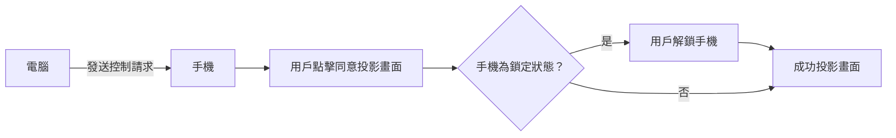

用過iPhone mirroring的都知道，在Mac上控制iPhone不需要手動解鎖手機，整個連接的體驗可說是十分絲滑。（這就是封閉系統的好處嗎😆

然而，PC陣營就沒有這個待遇了。

因為Window和Android是不同廠商，彼此有安全性上的考量，所以可能永遠也不會有自動解鎖的功能。

但是！這兩個系統權限都足夠開放、自由，我們完全可以自己寫腳本，實現自動解鎖手機，媲美iPhone mirroring的絲滑體驗！😎

## 前置要求
- 電腦：Link to Windows 配對好手機
- 手機：Play Store 搜尋並安裝 MacroDroid

## Link to Windows 遠控手機流程


需要自動化的部分：
- 點擊同意投影畫面
- 解鎖手機

## 設定流程
以下流程基於小米手機，其他品牌要自己微調腳本。

米粉可以直接抄作業了😇
![[Auto_confirm_Link_to_windows.macro]]
![[Unlock_phone.ablock]]
腳本截圖：
![[Screenshot_2025-07-13-00-18-28-770_com.arlosoft.macrodroid.jpg|400]]
![[Screenshot_2025-07-13-00-17-28-157_com.arlosoft.macrodroid-edit 1.jpg|400]]
### 設置MacroDroid
1. 自動同意投影畫面

	我首先給予這兩個系統應用 project_media 權限：
	- 連接至Windows
	- Device Integration Service（負責用戶確認介面）
	 
	測試後還是會顯示要求權限的介面，因此可以得知這個介面是他們魔改過的，不是直接調用系統權限的介面。
	
	所以，改用無障礙權限直接點擊。
	
	在macrodroid中創建腳本並新增trigger，檢測螢幕內容，檢測範圍只選擇Device Integration Service 這個系統應用，沒限制的話會一直檢測螢幕內容很耗電哦
	![[Screenshot_2025-07-12-23-48-04-541_com.arlosoft.macrodroid.jpg|400]]
	```
	要透過連結至 Windows 開始進行錄製或投放內容嗎
	```
	
	Include overlays 要打勾 ✅
	
	這樣檢測到該文本後就可以自動執行點擊Action了


2. 自動解除鎖定畫面

	當手機處於鎖定狀態，Link to Windows連接時會自動轉跳至輸入密碼頁面

	所以，加入一個wait until trigger 檢測鎖定畫面的文字，小米手機是：
	
	```sh
	請用數字密碼或指紋解鎖
	```
	
	並設定cancel after timeout，因為沒有檢測到文字，就表示手機處於解鎖狀態，不需要持續檢測。

	![[Screenshot_2025-07-13-00-18-24-337_com.arlosoft.macrodroid.jpg|400]]

	剩下的解鎖action我放到action block裡面，也方便其他腳本調用。

	```
	📚 action block的概念就類似程式中的函數
	```

	```
	💡 如果你只有一個腳本要用話，就直接把輸入密碼的action放到同個腳本就好。
	```

	![[Screenshot_2025-07-13-00-17-28-157_com.arlosoft.macrodroid-edit 1.jpg|400]]

	在這個action block 定義兩個輸入變量，
	是否亮屏和切換至輸入密碼介面，用於執行特定操作。
	不過在我們這個場景中都用不到，所以忽略即可。
	
	後面的action group 就是放輸入密碼的action。
	
	```
	📚 action group 的用途就是把很多action放到一個群組裡面，方便移動位置。
	```
	
	```
	💡 如果你用的不是數字密碼，就用UI Interaction 裡面的paste 把你的密碼輸入進去就好。
	或者直接用作者的pin unlock的action，但輸入密碼中間的間隔會比較久，因該有兼容性考量，我就沒有使用。
	```
	
3. 腳本設置完成！

   可以來測試效果了，沒意外的話，你應該可以做到像我影片中所展示的效果。

<video width="400" controls>
<source src="auto_link2windows_mute_.mp4">
</video>


