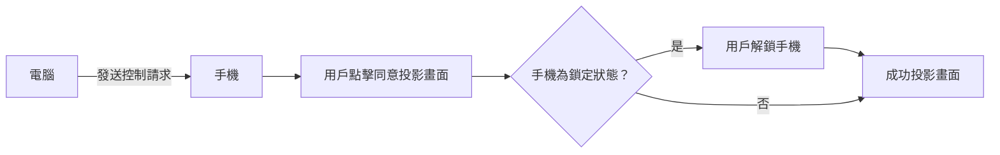

## 目標
媲美 iPhone mirroring，在手機端無須手動確認與解鎖即可內網遠程操控。

Window和Android是不同廠商應該有安全性上的考量，大概只能自己寫腳本自動化這個流程了😅。

## 前置要求與設置
- Android, Windows各一台
- 電腦的 Link to Windows 配對好手機
- 手機到 Play Store 下載好 MacroDroid 軟體

## Link to Windows 遠控手機流程


所以要需要自動化的部分為：
- 點擊同意投影畫面
- 解鎖手機

## 設定流程
以下是基於小米手機，不同品牌可能不竟相同。

完整腳本：
![[Screenshot_2025-07-13-00-18-28-770_com.arlosoft.macrodroid.jpg|400]]
![[Screenshot_2025-07-13-00-17-28-157_com.arlosoft.macrodroid-edit 1.jpg|400]]

1. 點擊同意投影畫面

	我本以為是調用系統的權限介面，但嘗試過使用給予 連接至Windows 和 Device Integration Service（負責確認介面） 這個兩個系統應用 project_media權限，還是會出現要求權限的介面，因此，看來不是直接調用系統權限介面，無法繞過。

	所以改用無障礙權限直接點擊。
	
	在macrodroid創建腳本使用trigger，檢測螢幕內容，檢測範圍只選擇Device Integration Service 這個系統軟體，沒限制的話會一直檢測螢幕內容很耗電哦
	![[Screenshot_2025-07-12-23-48-04-541_com.arlosoft.macrodroid.jpg|400]]
	```
	要透過連結至 Windows 開始進行錄製或投放內容嗎
	```
	
	Include overlays 要打勾 ✅
	
	這樣檢測到該文本後就可以進行點擊Action了


2. 解鎖手機

	若手機處於鎖定狀態，會自動轉跳到輸入密碼頁面

	所以加入一個wait until trigger 檢測鎖定畫面的文字，小米手機是：
	
	```sh
	請用數字密碼或指紋解鎖
	```
	
	並設定cancel after timeout，因為如果手機本就處於解鎖狀態，就不用繼續流程了。

	![[Screenshot_2025-07-13-00-18-24-337_com.arlosoft.macrodroid.jpg|400]]

	剩下的解鎖action我放到action block裡面，也方便其他腳本調用。

	```
	📚 action block的概念就類似程式中的函數
	```

	```
	💡 如果你只有一個腳本要用話，就直接把輸入密碼的action放到同個腳本就好。
	```

	![[Screenshot_2025-07-13-00-17-28-157_com.arlosoft.macrodroid-edit 1.jpg|400]]

	在這個action block 我定義兩個輸入變量，
	是否亮屏和切換至輸入密碼介面，用於執行特定操作。
	不過在我們這個場景中都用不到，所以忽略即可。
	
	後面的action group 就是放輸入密碼的action。
	
	```
	📚 action group 的用途就是把很多action放到一個群組裡面，方便移動位置。
	```
	
	```
	💡 如果你用的不是數字密碼，就用UI Interaction 裡面的paste 把你的密碼輸入進去就好。
	或者直接用作者pin unlock的action，但因該是兼容性考量，輸入密碼中間的間隔比較久，所以我就沒有使用。
	```
	
3. 腳本設置完成！

   可以來測試效果了，沒意外的話，你應該可以做到像我影片中所展示的效果。

<video width="400" controls>
<source src="auto_link2windows_mute_.mp4">
</video>


